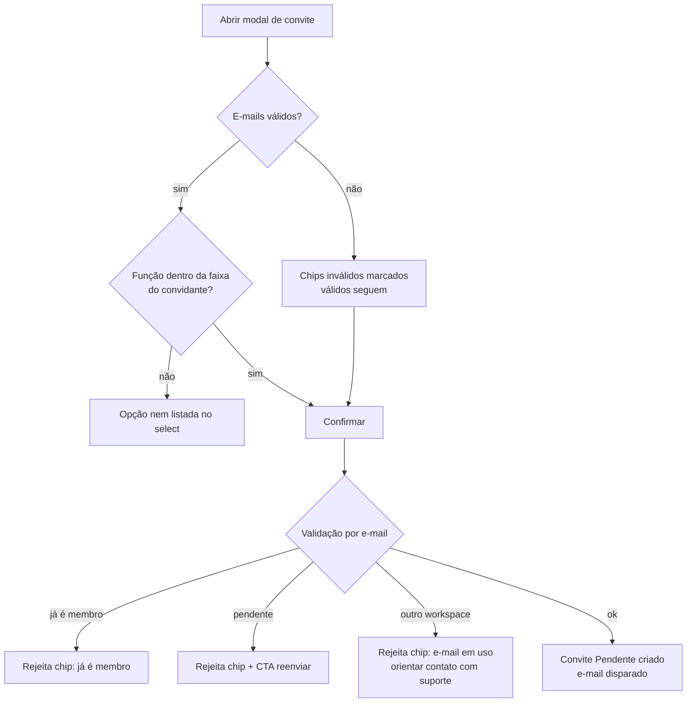

> Fatia do spec `Perfis e Permissões (Workspace) · v1`. As regras transversais (matriz de permissões, regras globais, catálogo de mensagens) estão em `.cursor/rules/governanca.mdc` e valem para TODA implementação.

## Módulo 3 — Membros

### Story 3.1: Listar membros

**Prioridade:** P1 · **Dependências:** 1.3

#### User Story
> **Como** Dono ou Administrador,
> quero **ver todos os membros com seus times, função e status**,
> para **auditar rapidamente quem tem acesso a quê**.

#### Contexto
Tabela única: nome, e-mail, time(s), função, status (**Ativo / Pendente / Inativo**), three-dot com ações (editar, reenviar/revogar convite quando pendente, inativar/reativar, remover). Dono vê todos; Administrador vê membros dos seus times. Pendentes aparecem na mesma lista — não há uma "aba de convites" separada, para reduzir superfície.

#### Fluxo

**Entry points:** Gestão do Workspace > Membros.

**Happy path:**
1. Dono acessa Membros.
2. Sistema lista membros com colunas nome, e-mail, times (chips), função, status, three-dot.
3. Dono filtra por status/função ou busca por nome/e-mail.

**Caminhos alternativos e de erro:**
- **Administrador:** lista restrita a membros dos seus times; membros sem interseção de time não aparecem.
- **Membro pendente:** nome exibido como o e-mail (ainda não há perfil), badge Pendente, ações de convite no three-dot.

#### Estados de tela

| Tela | Default | Loading | Vazio | Erro | Sucesso |
|------|---------|---------|-------|------|---------|
| Lista de membros | Tabela com filtros e busca | Skeleton de linhas | Só o Dono no workspace: CTA "Convidar membros" em destaque | Erro de carga + retry | Ações refletem sem reload |

#### Critérios de Aceite

**AC1: colunas e status**
```
Given o workspace tem membros ativos, pendentes e inativos
When acesso Gestão > Membros
Then cada linha exibe nome/e-mail, times, função e o status correto
```

**AC2: escopo do Administrador**
```
Given sou Administrador apenas do time A
When acesso Membros
Then vejo somente membros que pertencem ao time A
```

**AC3: busca e filtro combinados**
```
Given a lista tem 40 membros
When filtro por status Pendente e busco "maria"
Then vejo apenas pendentes cujo e-mail contém "maria"
```

#### Edge Cases
- [ ] **Centenas de membros:** paginação + busca server-side.
- [ ] **Membro em muitos times:** chips truncados ("A, B +3") com tooltip completo.

#### Out of Scope
- Ações das linhas (Stories 3.2–3.4, 4.2).

---

### Story 3.2: Convidar membro

**Prioridade:** P1 · **Dependências:** 3.1

#### User Story
> **Como** Dono, Administrador, Editor ou Observador,
> quero **convidar pessoas por e-mail definindo função e time(s) no próprio convite**,
> para **que elas entrem no workspace já no lugar certo, sem configuração posterior**.

#### Contexto
O convite carrega **função + time(s)**. Regra de faixa: cada função convida **na mesma função ou abaixo** — Dono convida Administrador/Editor/Observador; Administrador convida Administrador/Editor/Observador; Editor convida Editor/Observador; Observador convida Observador. **Ninguém convida Dono** (Dono só existe via nível interno). Campo aceita múltiplos e-mails.

#### Fluxo

**Entry points:** CTA "Convidar" em Gestão > Membros; ação "Inserir pessoas" no seletor de time (1.1); bloco de convites do onboarding (0.1).

**Happy path:**
1. Usuário aciona Convidar.
2. Modal: campo de e-mails (chips, multi), select de Função (opções limitadas pela faixa do convidante), multi-select de Time(s) (limitado aos times do convidante, no caso de Administrador/Editor; Dono vê todos).
3. Confirma → convites criados com status **Pendente**, e-mails disparados, linhas aparecem na lista de Membros.

**Caminhos alternativos e de erro:**
- **E-mail já é membro do workspace:** chip rejeitado inline ("já é membro").
- **E-mail com convite pendente:** chip rejeitado com atalho "Reenviar convite".
- **E-mail pertence a outro workspace:** convite bloqueado (restrição vigente da plataforma) com mensagem clara — ver OQ1.
- **E-mail com formato inválido:** chip marcado em erro; válidos seguem.
- **Falha parcial no envio (3 ok, 1 falha):** criar os que deram certo; reportar a falha nominalmente no toast.



#### Estados de tela

| Tela | Default | Loading | Vazio | Erro | Sucesso |
|------|---------|---------|-------|------|---------|
| Modal convidar | E-mails vazio, função default Editor, time atual pré-selecionado | Botão em spinner | n/a | Inline por chip; global preserva dados | Fecha, toast com contagem, pendentes na lista |

#### Critérios de Aceite

**AC1: convite carrega função e time**
```
Given sou Dono
When convido ana@empresa.com como Observador no time "Descoberta"
Then é criado convite Pendente com função Observador vinculado a "Descoberta"
  And ana@empresa.com recebe o e-mail de convite
```

**AC2: faixa de convite aplicada na origem**
```
Given sou Editor
When abro o modal de convite
Then o select de função oferece somente Editor e Observador
```

**AC3: ninguém convida Dono**
```
Given sou Dono
When abro o select de função no convite
Then a opção "Dono do Workspace" não existe
```

**AC4: multi-e-mail em um disparo**
```
Given colei 5 e-mails válidos separados por vírgula
When confirmo o convite como Editor no time A
Then 5 convites Pendentes são criados com a mesma função e time
```

**AC5: escopo de time do convidante**
```
Given sou Administrador apenas do time A
When abro o multi-select de times no convite
Then vejo apenas o time A
```

#### Edge Cases
- [ ] **Duplo clique no confirmar:** idempotente — 1 convite por e-mail.
- [ ] **E-mail com maiúsculas/espacos ("  Ana@X.com "):** normalizar (trim + lowercase) antes de validar duplicidade.
- [ ] **Convidante perde a permissão entre abrir o modal e confirmar:** backend revalida a faixa no confirm; erro claro.
- [ ] **Colar lista com 50+ e-mails:** aceitar; processar em lote com resultado consolidado (criados / rejeitados nominalmente).

#### Out of Scope
- Aceite do convite (Story 4.1); reenvio/revogação (4.2).
- Convite por domínio, link público de convite (non-goal v1 — candidatos fortes à v1.1 pela dor de adoção).

---

### Story 3.3: Editar membro

**Prioridade:** P1 · **Dependências:** 3.1

#### User Story
> **Como** Dono ou Administrador,
> quero **alterar a função e os times de um membro**,
> para **refletir mudanças de responsabilidade sem remover e reconvidar**.

#### Contexto
Edição em modal a partir do three-dot: função (respeitando a faixa do editor — Administrador não promove ninguém a Dono) e times (Administrador limitado aos seus). A função é global: alterar reflete em todos os times do membro imediatamente.

#### Fluxo

**Entry points:** three-dot do membro na lista > "Editar".

**Happy path:**
1. Dono abre edição de um membro Editor.
2. Altera função para Administrador e adiciona o time B.
3. Confirma → permissões refletem imediatamente (próximo request do membro).

**Caminhos alternativos e de erro:**
- **Administrador tentando editar o Dono:** ação não disponível (three-dot do Dono não exibe "Editar" para Administradores).
- **Rebaixar o único Dono:** bloqueado — "O workspace precisa de ao menos um Dono ativo" (regra transversal).
- **Remover todos os times do membro:** alerta reforçado (estado "sem time", como em 2.4).

#### Estados de tela

| Tela | Default | Loading | Vazio | Erro | Sucesso |
|------|---------|---------|-------|------|---------|
| Modal editar membro | Função e times atuais | Botão em spinner | n/a | Inline + global | Fecha, toast, lista e permissões atualizadas |

#### Critérios de Aceite

**AC1: alteração de função é imediata e global**
```
Given Maria é Editor nos times A e B
When o Dono a altera para Observador
Then no próximo request Maria perde ações de criação/edição em A e B
  And o bloco de créditos deixa de ser exibido para ela
```

**AC2: faixa vale na edição**
```
Given sou Administrador
When edito a função de um membro
Then as opções são Administrador, Editor e Observador (nunca Dono)
```

**AC3: proteção do último Dono**
```
Given o workspace tem exatamente 1 Dono ativo
When tento alterar a função desse Dono
Then a ação é bloqueada com mensagem explicativa
```

#### Edge Cases
- [ ] **Membro editado está em sessão ativa:** permissões aplicadas no próximo request; sem necessidade de relogin.
- [ ] **Dois admins editam o mesmo membro simultaneamente:** última escrita vence; log interno registra ambas.
- [ ] **Editar membro Pendente:** função/times do convite são editáveis pelo mesmo modal (reflete no aceite).

#### Out of Scope
- Transferência de propriedade (Dono → outro membro): decidido — permanece 100% via nível interno/CX na v1.

---

### Story 3.4: Inativar, reativar e remover membro

**Prioridade:** P1 · **Dependências:** 3.1

#### User Story
> **Como** Dono ou Administrador,
> quero **inativar (e reativar) ou remover membros**,
> para **cortar acesso imediatamente quando alguém sai da empresa ou muda de área**.

#### Contexto
Dois níveis: **inativar** (reversível — membro não autentica, vínculos preservados) e **remover** (desvincula do workspace). Inativar é o caminho recomendado para desligamentos; remover, para correções (convidou errado). Estudos criados pelo membro permanecem nos times (estudo pertence ao time). Administrador age dentro da faixa (não inativa/remove Dono).

#### Fluxo

**Entry points:** three-dot do membro > "Inativar" / "Remover".

**Happy path (inativar):**
1. Dono aciona Inativar em um membro ativo.
2. Confirmação com consequência ("perde acesso imediato; estudos e histórico preservados").
3. Membro passa a status Inativo; sessões ativas são derrubadas no próximo request.

**Caminhos alternativos e de erro:**
- **Reativar:** three-dot do inativo > "Reativar" → volta ao status Ativo com os mesmos times/função.
- **Remover:** confirmação reforçada (digitar "REMOVER" não é necessário — manter leve; modal destaca a irreversibilidade do vínculo).
- **Inativar/remover o último Dono ativo:** bloqueado (regra transversal).
- **Inativar a si mesmo:** bloqueado ("Peça a outro administrador").

#### Estados de tela

| Tela | Default | Loading | Vazio | Erro | Sucesso |
|------|---------|---------|-------|------|---------|
| Confirmação inativar/remover | Nome + consequências | Spinner | n/a | Erro + retry | Toast, status/lista atualizados |

#### Critérios de Aceite

**AC1: inativação corta acesso e preserva dados**
```
Given João está ativo com estudos criados no time A
When o inativo
Then João não consegue mais autenticar
  And os estudos dele continuam visíveis no time A
  And a linha dele aparece como Inativo na lista
```

**AC2: reativação restaura o estado**
```
Given João está Inativo (era Editor nos times A e B)
When o reativo
Then ele volta a autenticar como Editor nos times A e B
```

**AC3: proteção do último Dono**
```
Given o workspace tem 1 Dono ativo
When tento inativá-lo ou removê-lo
Then a ação é bloqueada com mensagem explicativa
```

**AC4: faixa na gestão**
```
Given sou Administrador
When abro o three-dot de um membro Dono
Then as ações Inativar e Remover não são exibidas
```

#### Edge Cases
- [ ] **Membro removido tinha convites pendentes enviados por ele:** convites permanecem válidos e passam a ser geríveis por qualquer Dono/Administrador do time (nunca ficam órfãos).
- [ ] **Remover membro que é o único Administrador de um time:** permitido; time fica sem Administrador — Dono segue gerindo; alerta informativo no confirm.
- [ ] **Membro inativado no meio de uma edição de estudo:** alterações não salvas se perdem; próximo request retorna 401.

#### Out of Scope
- Exclusão de dados pessoais/LGPD (fora deste épico — processo à parte).

---
